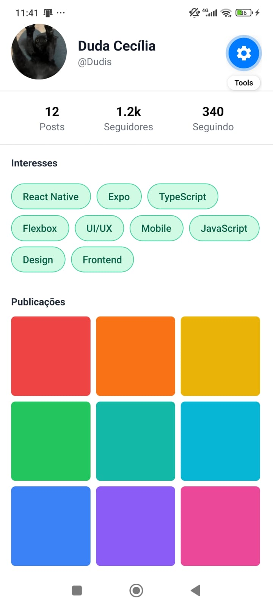
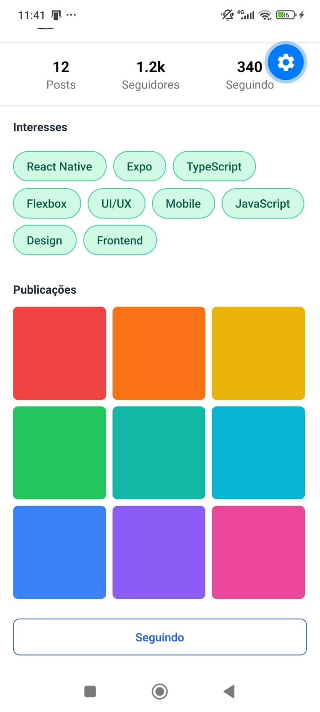

# Atividade prática da disciplina Programação para Dispositivos Móveis

## Como executar o projeto

### Pré-requisitos

- Node.js 20+ instalado
- Aplicativo Expo Go instalado no celular
- Celular e computador na mesma rede Wi-Fi

### Instalação

```bash
npm install
```

### Execução

```bash
npx expo start
```

Escaneie o QR Code que aparece no terminal usando o app Expo Go.

### Outras formas de rodar

| Comando | O que faz |
|---|---|
| `npx expo start` | Inicia o servidor de desenvolvimento |
| `npx expo start --clear` | Inicia limpando o cache |
| Pressione `w` no terminal | Abre no navegador web |
| Pressione `a` no terminal | Abre no Android Emulator |
| Pressione `i` no terminal | Abre no iOS Simulator (apenas macOS) |

---

## Estrutura do projeto

```
atividade-flexbox-1/
├── App.tsx                              # Ponto de entrada (SafeAreaProvider + TelaPerfil)
├── app.json                             # Configurações do Expo
├── package.json
├── tsconfig.json
├── prints/                              # Prints de tela para o README
│   ├── tela-perfil.jpeg
│   └── botao-seguindo.jpeg
└── src/
    ├── components/
    │   ├── IconeComTexto.tsx            # Questão 1
    │   ├── LinhaDeAcoes.tsx             # Questão 2
    │   ├── ListaDeChips.tsx             # Questão 3
    │   ├── GradeDePublicacoes.tsx       # Questão 4
    │   ├── BotaoSeguir.tsx              # Questão 5
    │   └── RefatoracaoEstilos.tsx       # Questão 6
    └── screens/
        └── TelaPerfil.tsx               # Desafio Final
```

---

## Questões desenvolvidas

### Questão 1 — `<IconeComTexto>`

Ícone (View 24×24) ao lado de um texto, ambos centralizados verticalmente.

Conceito aplicado:
```tsx
container: { flexDirection: "row", alignItems: "center", gap: 12 }
```

---

### Questão 2 — `<LinhaDeAcoes>`

Ícone à esquerda e botão "Ver mais" à direita, com máximo de espaço entre eles.

Conceito aplicado:
```tsx
container: { flexDirection: "row", justifyContent: "space-between" }
```

---

### Questão 3 — `<ListaDeChips>`

Recebe um array de strings via props e renderiza cada uma como chip. Os chips quebram linha automaticamente quando não cabem na largura, com espaçamento uniforme.

Conceito aplicado:
```tsx
container: { flexDirection: "row", flexWrap: "wrap", gap: 8 }
```

**Testado com:** 9 strings (React Native, Expo, TypeScript, Flexbox, UI/UX, Mobile, JavaScript, Design, Frontend).

---

### Questão 4 — `<GradeDePublicacoes>`

Grade com exatamente 3 colunas por linha. Usa `useWindowDimensions()` para calcular o tamanho exato de cada quadrado, considerando padding lateral e gaps.

Conceito aplicado:
```tsx
const larguraDisponivel = width - PADDING_LATERAL * 2 - GAP * (COLUNAS - 1);
const tamanhoItem = Math.floor(larguraDisponivel / COLUNAS);
```

Testado com: 9 cores fictícias. A última linha incompleta mantém o alinhamento.

---

### Questão 5 — `<BotaoSeguir>`

Botão que alterna entre dois estados ao ser tocado, com estilização condicional.

| Estado | Aparência |
|---|---|
| "Seguir" | Fundo azul preenchido, texto branco |
| "Seguindo" | Fundo transparente, borda azul, texto azul |

Conceito aplicado:
```tsx
const [seguindo, setSeguindo] = useState(false);
style={[styles.botao, seguindo ? styles.seguindo : styles.naoSeguindo]}
```

Um único componente, sem duplicação.

---

### Questão 6 — Refatoração de estilos

O componente `<RefatoracaoEstilos>` reproduz visualmente idêntico o `StyleSheet.create` original fornecido no enunciado:

```js
const styles = StyleSheet.create({
  row: { flexDirection: "row", justifyContent: "space-between", padding: 16 },
  card: { flex: 1, alignItems: "center" },
});
```

---

## Desafio Final — Tela de Perfil

Tela completa de perfil com dados fictícios, composta por:

| Seção | Descrição |
|---|---|
| Header | Avatar circular + nome + username empilhados verticalmente, com `alignItems: "center"` |
| Estatísticas | 3 blocos (Posts, Seguidores, Seguindo) lado a lado com `justifyContent: "space-evenly"` |
| Interesses | Lista de 9 chips que quebram linha automaticamente (`flexWrap: "wrap"` + `gap`) |
| Publicações | Grade 3×3 com 9 quadrados coloridos (reuso da Questão 4) |
| Rodapé| Botão "Seguir" com largura total (reuso da Questão 5) |

---

## Prints de tela

### Tela de Perfil completa



### Estado alternado do botão — "Seguindo"



---

## Tecnologias utilizadas

- [React Native](https://reactnative.dev/)
- [Expo](https://expo.dev/) — SDK 57
- [TypeScript](https://www.typescriptlang.org/)
- [react-native-safe-area-context](https://github.com/th3rdwave/react-native-safe-area-context)

---
